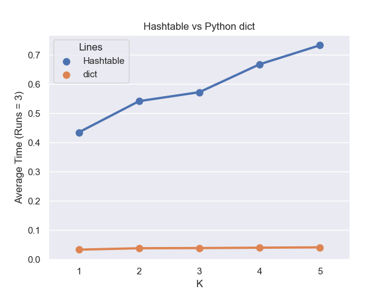

# This Application is a Speaker Recognition System

Analyze given files from different speakers and assess the best possible speaker for an unknown text.

This speaker recognition system works based on speech analysis using Markov Model (https://en.wikipedia.org/wiki/Markov_model).

## Video Demo

[](https://youtu.be/Mq9X2Gq9KW0)

## Usage
Run the following code in command line:
```
$ python speaker-recognition.py speechA speechB speechC k-value data_structure_to_use
```

* The first argument is the path to speaker A's known speech.
* The second argument is the path to speaker B's known speech.
* The third argument is the path to unknown speech.
* The fourth argument is the order `k` to use for the Markov models.
* The fifth argument is either the string "hashtable" or "dict", indicating which implementation to use.

for a quick run using demo texts, try:
```
$ python speaker-recognition.py speeches/bush1+2.txt speeches/kerry1+2.txt speeches/bush-kerry3/BUSH-0.txt 2 hashtable
```
which will result in:
```
Speaker A: -2.1670591295191572
Speaker B: -2.2363636778055525

Conclusion: Speaker A is most likely
```

## Implementation
### Build Customized Hashtable
* A custom-tailored hashtable module using Linear Probing
* Rehashing: when records go over `load_factor` after an update, expand the table by `growth_factor` and migrate all data into new hash table (i.e., each key-value pair is hashed again)
* Deletion: in order not to potentially invalidate the entire table when removing one key-value pair, the deletion is indicated using a `is_deleted` marker instead. Actual removal will happen during rehashing.

### Build the Markov Model (Algorithm)
* Markov Model goes beyond the frequency of specific letters or words in a speech, it captures the relationships between words or letters in sequences.(e.g: we can identify letter “q” appears in a certain frequency and also it is virtually always followed by letter “u.” Similarly, “to be” is a much more likely word sequence than “to is.”)
* the Markov Model will be represented as `Hashtable` 
* Given an integer value of `k` at the start of the program. The hashtabke contains all string keys with length `k` and `k + 1`(wrap around when at the end of the text), and values set to the number of times those keys appeared in the text as substrings.

* Example 
    ```
    Text: "This_is_."
    ```

    Below is the table of all `k` and `k+1` length strings when `k` = 2:

    

    The Markov Model will count the frequency those `k` and `k + 1` string keys occur in the text.
    

### Analyze Unknown Speech
* Build similar table for unknown text
* Use Log Probability `log(M/N)` to represent the probability of the model generating the unknown sequence. (M: number of times that a string of length `k+1` occurs, N: number of times that a string of length `k` occurs)
* The specific letter sequences in new text are not necessarily guaranteed to appear in original text. To avoid the risk of zero division error: Laplace smoothing using `log((M + 1)/(N + S))`. `S` is the size of the ”alphabet” of possible characters, also compensate the fact that we have modified the denominator -- a theoretically sound way to balance this is to add one to the numerator.


* For example, when the unknown text is  `This`, below table shows the total likelihood of all the individual likelihoods.

    

## Performance

performance.py runs performance tests on the model using both the customized `Hashtable` and python's default `dict`.

Run below line for the performance test:
```
$ python performance.py speechA speechB speechC k-value number_of_test_runs
```

* The first argument is the path to speaker A's known speech.
* The second argument is the path to speaker B's known speech.
* The third argument is the path to unknown speech.
* The fourth argument is the maximum `k` to use for the Markov models.
* The fifth argument is the number of test runs.

For a quick demo using example files, run:
```
$ python performance.py speeches/bush1+2.txt speeches/kerry1+2.txt speeches/bush-kerry3/BUSH-0.txt 2 3
```
(Run 3 times, k max = 2)

    | Data Structure | K | Run | Time |
    |----------------|---|-----|------|
    | hashtable      | 1 | 1   | 0.345|
    | hashtable      | 1 | 2   | 0.302|
    | hashtable      | 1 | 3   | 0.386|
    | hashtable      | 2 | 1   | 0.585|
    | hashtable      | 2 | 2   | 0.598|
    | hashtable      | 2 | 3   | 0.611|
    | dict           | 1 | 1   | 0.045|
    | dict           | 1 | 2   | 0.130|
    | dict           | 1 | 3   | 0.075|
    | dict           | 2 | 1   | 0.145|
    | dict           | 2 | 2   | 0.166|
    | dict           | 2 | 3   | 0.202|

## Graphing

After running the performance test, a `seaborn` graph will be saved as `execution_graph.png` to show the test result:



## Acknowledgment
The original idea of this analysis model was developed by Rob Schapire with contributions from Kevin Wayne.
