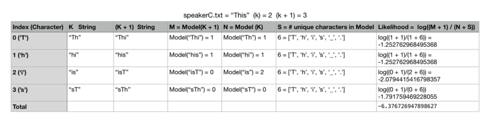

# Speaker Recognition System

Analyze given files from different speakers and assess the best possible speaker for an unknown text.

This speaker recognition system works based on speech analysis using Markov Model (https://en.wikipedia.org/wiki/Markov_model).

## Video Demo

[](https://youtu.be/Bf1JCaIo9FM)

## Usage
Run the following code in command line:
```
$ python speaker-recognition.py speechA speechB speechC k-value hashtable
```

* The first argument is the path to speaker A's known speech.
* The second argument is the path to speaker B's known speech.
* The third argument is the path to unknown speech.
* The fourth argument is the order `k` to use for the Markov models.
* The fifth argument is either the string "hashtable" or "dict", indicating which implementation to use.

for a quick run using demo texts, try:
```
$ python speaker-recognition.py speeches/bush1+2.txt speeches/kerry1+2.txt speeches/bush-kerry3/BUSH-0.txt 2 hashtable
```
which will result in:
```
Speaker A: -2.1670591295191572
Speaker B: -2.2363636778055525

Conclusion: Speaker A is most likely
```

## Implementation
### Build Customized Hashtable
* A custom-tailored hashtable module using Linear Probing
* Rehashing: when records go over `load_factor` after an update, expand the table by `growth_factor` and migrate all data into new hash table (i.e., each key-value pair is hashed again)
* Deletion: in order not to potentially invalidate the entire table when removing one key-value pair, the deletion is indicated using a `is_deleted` marker instead. Actual removal will happen during rehashing.

### Build the Markov Model (Algorithm)
* Markov Model goes beyond the frequency of specific letters or words in a speech, it captures the relationships between words or letters in sequences.(e.g: we can identify letter “q” appears in a certain frequency and also it is virtually always followed by letter “u.” Similarly, “to be” is a much more likely word sequence than “to is.”)
* the Markov Model will be represented as `Hashtable` 
* Given an integer value of `k` at the start of the program. The hashtabke contains all string keys with length `k` and `k + 1`(wrap around when at the end of the text), and values set to the number of times those keys appeared in the text as substrings.

### Example 
```
Text: "This_is_."
```

Below is the table of all k and k+1 length strings when k = 2:


The Markov Model will count the frequency those `k` and `k + 1` string keys occur in the text.


### Analyze Unknown Speech
* Build similar table for unknown text
* Use Log Probability `log(M/N)` to represent the probability of the model generating the unknown sequence. (M: number of times that a string of length `k+1` occurs, N: number of times that a string of length `k` occurs)
* The specific letter sequences in new text are not necessarily guaranteed to appear in original text. To avoid the risk of dividing by zero: Laplace smoothing using `log((M + 1)/(N + S))`. `S` is the size of the ”alphabet” of possible characters, also to compensate the fact that we have modified the denominator -- a theoretically sound way to balance this is to add one to the numerator.


For example, the unknown text is

```
This
```

Calculating the total likelihood requires summing all of the individual likelihoods.



## Performance

performance.py will run performance tests on the model with the customized `Hashtable` and python's default `dict`.

This file will also take five command line arguments:

* The first argument is the name of a text file with speeches from speaker A.
* The second argument is the name of a text file with speeches from speaker B.
* The third argument is the name of a text file with text to classify.
* The fourth argument is the maximum `k` to use for the Markov models.
* The fifth argument is the number of runs to measure performance.

```
$ python performance.py speeches/bush1+2.txt speeches/kerry1+2.txt speeches/bush-kerry3/BUSH-0.txt 2 3
```

This would indicate that you want three runs, for `k=1` and `k=2`, your pandas dataframe might look something like:

| Implementation | K | Run | Time |
|----------------|---|-----|------|
| hashtable      | 1 | 1   | 0.345|
| hashtable      | 1 | 2   | 0.302|
| hashtable      | 1 | 3   | 0.386|
| hashtable      | 2 | 1   | 0.585|
| hashtable      | 2 | 2   | 0.598|
| hashtable      | 2 | 3   | 0.611|
| dict           | 1 | 1   | 0.045|
| dict           | 1 | 2   | 0.130|
| dict           | 1 | 3   | 0.075|
| dict           | 2 | 1   | 0.145|
| dict           | 2 | 2   | 0.166|
| dict           | 2 | 3   | 0.202|

We run multiple times because a single run can be affected by unrelated issues elsewhere on the system.

You will use these timings to make a `seaborn` graph to show how times fluctuated based on the implementation and increasing `k` value.  For each timing above you will then take the average of those timings for each `k`.

**Note:** The structure above might not be the way you choose to structure your dataframe.  **You can only use one pandas dataframe.**

Given that you will be graphing the data inside the dataframe, I would highly recommend you think about how to structure the code based on how `seaborn` will need the data.

**Pandas Tip:** Keep `df.groupby`and `df.loc` in mind.

You can accurately time your code using a snippet like the below:

```
import time

start = time.perf_counter()
tup = identify_speaker(speech1, speech2, speech3, k, use_hashtable=True)
elapsed = start - time.perf_counter()
```

### Graphing

After producing your `pandas` dataframe, you will produce a `seaborn` graph where the x axis will be the `k` values and the y axis will be the **average time of the runs** for each k value per implementation type.  Here's an example graph:


Your graph should be similar, with axes labeled and appropriately scaled so we can see the values.  (That is, if your values are in the range [0, 1] do not make the scale of your graph [0, 14].

You can use a point plot with the following arguments:

```
sns.pointplot(..., linestyle='-', marker='o')
```

Your code should save this graph as `execution_graph.png`.

## Acknowledgment
The original idea of this analysis model was developed by Rob Schapire with contributions from Kevin Wayne.
